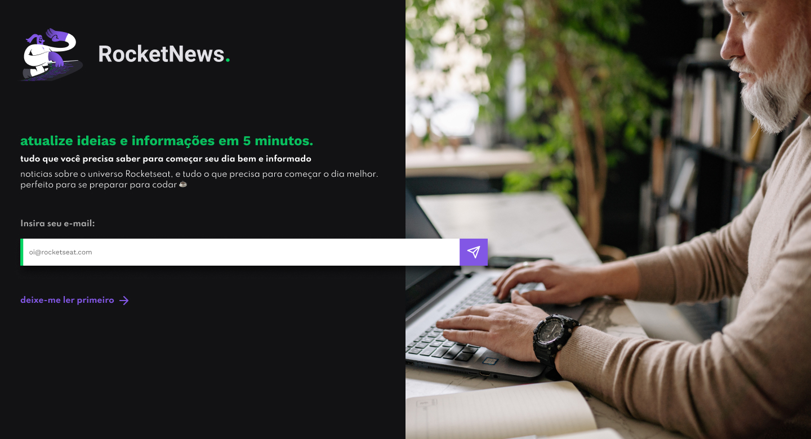

<h1 align="center"> RocketNews </h1>

Discover são desafios, promovido pela Rocketseat para ensino de tecnologias WEB.

<h3 align="center">Navegação</h3>

  <a href="#-tecnologias">Tecnologias</a>&nbsp;&nbsp;&nbsp;|&nbsp;&nbsp;&nbsp;
  <a href="#-layout">Layout</a>&nbsp;&nbsp;&nbsp;|&nbsp;&nbsp;&nbsp;
  <a href="#memo-licença">Licença</a>

  

 

  

## 🚀 Tecnologias

Esse projeto foi desenvolvido com as seguintes tecnologias:

- HTML e CSS
- Git e Github
- Figma

## 🔖 Layout

Você pode visualizar o layout do projeto através [DESSE LINK](https://www.figma.com/community/file/1241119530230478440). É necessário ter conta no [Figma](https://figma.com) para acessá-lo.
## :memo: Licença

Esse projeto está sob a licença MIT.

---

Feito com ♥ por Mussinady Abubacar :wave: [Me siga...!](https://github.com/mussinady-abubacar)
